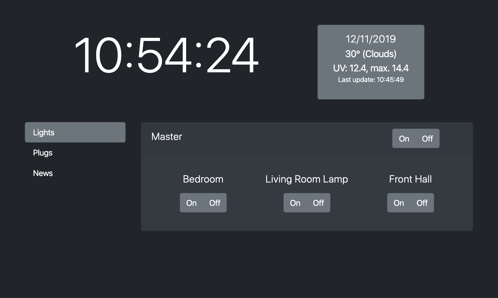

# PiSmartDisplay

A simple smart home and info display for the Raspberry Pi. Right now, you can:
- Control Philips Hue lights
- Control TP-Link plugs
- View time, weather, and UV info
- View top three news stories from a properly formatted news feed.

## Screenshot

## Status

This is a work in progress so expect things to potentially go wrong. However, code is only checked in when it is presumed to work.

I'm not a professional coder so there is a lot to fix and improve. In that light, I know that things may be broken and/or poorly implemented. I'm happy to take suggestions though.

## Setup

Setup is annoying at this point. I'm hoping, in the future, to automate this with an install script.

### Pi Setup

The following is courtesy of and based on Die Antwort's ([source](https://die-antwort.eu/techblog/2017-12-setup-raspberry-pi-for-kiosk-mode/)) instructions. It's provided here for posterity.

1. Start with a clean and updated copy of Raspbian Lite (nothing prevents the app working with any RPi Linux distro but this is written with Raspbian in mind).

2. In raspi-config, make sure:

    a. Boot Options -> Desktop/CLI is set to "Console Autologin"
    
    b. Localisation Options -> Change Timezone -> set accordingly.
    
    c. Interfacing Options -> SSH -> enable SSH.

3. Install the following to set up a minimum set of packages (X.org, xscreensaver and Openbox):

    `sudo apt-get install --no-install-recommends xserver-xorg x11-xserver-utils xinit xscreensaver openbox`

4. Install a web browser. You've got a few options (midori, firefox-esr, chromium-browser or vivaldi). All of these are available via apt except for Vivaldi which you will have to install by downloading it from their website. In my own testing, Chromium works well because you can scroll with one finger (one finger dragging in Firefox, for example, highlights text) and it has a simple kiosk mode. As such, the instructions below assume that you're using Chromium. Install it with:

    `sudo apt-get install --no-install-recommends chromium-browser`

5. Copy over the sample Openbox autostart config file:

    `sudo cp sample_openbox_autostart /etc/xdg/openbox/autostart`

6. Add the following to ~/.bash_profile to start X at boot:

    `[[ -z $DISPLAY && $XDG_VTNR -eq 1 ]] && startx -- -nocursor`

7. Create ~/.xscreensaver and add the following to it:

        timeout: 2
        mode: blank

    Change the timeout to however long you want the screen to stay on before the blank screensaver kicks in.

Nothing will work quite yet; restarting the Pi will result in the smart display opening up a blank Chromium window, in kiosk mode, that loads a failed page. Follow the next set of instructions to get the app up and running.

It's best, I would suggest, to restart the Pi at this point to make sure that you've got the "foundation" up and running. In other words, check to make sure that a reboot results in a fullscreen (kiosk mode) Chromium window opening to a broken/not found page.

### PiSmartDisplay Setup

1. Clone code:

    `git clone https://github.com/bryan-ab-smith/pismartdisplay.git`

2. Edit smartdisplay.service and change:

    a. User to the user that you have starting and autolgging in at boot.

    b. WorkingDirectory to the directory where the smart display code is stored.

3. Install the Python modules required:

    `pip3 install flask phue pyhs100 psutil`

4. Move static/config.json.template to static/config.json:

    `mv static/config.json.template static/config.json`

    See Config section below to edit the files.

5. Copy smart display service to /etc/systemd/system/ and enable the service:

    `sudo cp smartdisplay.service /etc/systemd/system`
    
    `sudo systemctl enable smartdisplay`

6. If you want to test things at this point, go to _http://HOSTNAME.local_ from a different device (where HOSTNAME is the hostname of your smart display). If that works, you should be good to go.

7. Reboot the Pi:

    `subo reboot`

8. Profit!

## Config

### static/config.json
This configuration file allows you to set up some custom settings to set the smart display up for your needs. More configuration coming but what's below works as of now.

| Key            | Value                      | Description/Note                                                                                                                     |
| -------------- |:--------------------------:| ------------------------------------------------------------------------------------------------------------------------------------:|
| owAPI_key      | API Key (string)           | This gives you access to OpenWeather data. See [here](https://openweathermap.org/appid) for information about getting the key.       |
| ow_loc         | Location for weather data  | This should be in the format `city,country_code`. For example, `Toronto,CA`                                                          |
| ow_units       | Units for the weather data | This should be either `metric` or `imperial`                                                                                         |
| ouvAPI_key     | API Key (string)           | This gives you access to OpenUV data. See [here](https://www.openuv.io/) for more information about getting the key.                 |
| lights_enabled     | `True` or `False`           | Enable or disable the light control (Philips Hue) functionality.      |
| bridge_address     | IP Address of the Philips Hue Bridge           | The IP address of the Philips Hue bridge. If you don't know what this is, open up the Philips Hue app -> Settings -> Hue Bridges -> Info icon -> IP Address.      |
| plugs_enabled     | `True` or `False`           | Enable or disable the plug control functionality.      |
| news_feed     | URL to a news feed.           | The news feed to show in the news section. A few top stories feeds are provided in the comments for the config file (SBS (Australia), CBC (Canada), BBC (UK), CNN (USA)).      |

NOTE: I'm not convinced that OpenWeather and OpenUV are super accurate (eg. ARPANSA data values in Australia are not the same as OpenUV data and the former is a more authoritative source). So, the data providers may change. In the meantime, this opens up the app to all people and provides, at the least, an approximate set of weather and UV data points.

### Other Notes
1. Restart only works if sudo is set to work as passwordless for the user running the app.
2. When you add a new smart device to your network, you need to restart the app (devices are added to the app during execution).
3. While this is designed to work on a Raspberry Pi with a small touchscreen, it's just a web app at heart so it will run anywhere Python is supported (ie. basically anywhere). So, you can run it on your local computer:

    `python3 index.py`

    Once that's running, navigate to _http://localhost:9000_.

4. This is developed with the official RPi LCD screen used as the reference display. This means that the UI is designed to fit nicely into a 800x480 space. This is not to say that it won't work elsewhere but that small tweaks may be required of you if you use a very different resolution.

## License

  
MIT License

Copyright (c) 2019 Bryan Smith

Permission is hereby granted, free of charge, to any person obtaining a copy
of this software and associated documentation files (the "Software"), to deal
in the Software without restriction, including without limitation the rights
to use, copy, modify, merge, publish, distribute, sublicense, and/or sell
copies of the Software, and to permit persons to whom the Software is
furnished to do so, subject to the following conditions:

The above copyright notice and this permission notice shall be included in all
copies or substantial portions of the Software.

THE SOFTWARE IS PROVIDED "AS IS", WITHOUT WARRANTY OF ANY KIND, EXPRESS OR
IMPLIED, INCLUDING BUT NOT LIMITED TO THE WARRANTIES OF MERCHANTABILITY,
FITNESS FOR A PARTICULAR PURPOSE AND NONINFRINGEMENT. IN NO EVENT SHALL THE
AUTHORS OR COPYRIGHT HOLDERS BE LIABLE FOR ANY CLAIM, DAMAGES OR OTHER
LIABILITY, WHETHER IN AN ACTION OF CONTRACT, TORT OR OTHERWISE, ARISING FROM,
OUT OF OR IN CONNECTION WITH THE SOFTWARE OR THE USE OR OTHER DEALINGS IN THE
SOFTWARE.