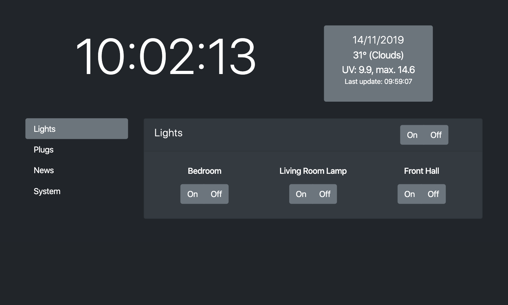

# Pi SmartScreen

A simple smart home and info display for the Raspberry Pi. Right now, you can control Philips Hue lights, TP-Link plugs and get time, weather (anywhere) and UV info (Australia only right now).

## Re-development (v2)

I designed this not to be something available for everyone and so the code isn't packaged in such a way as to make it "easy" for you. However, I am slowly working on making this more friendly to other setups, named _v2_ for now.

You can track progress in the various _v2_ files -- v2.py, v2.html, v2.js. These will eventually become the main Flask app. Don't expect this to work until it becomes the main script.

### Current status of v2
v2 runs and will control lights if properly configured (see the v2 Python script's configuration block at the top). Plugs don't work and the internationalisation of the UV index doesn't work (yet).

### Plan
- Dyanmic device creation. Right now, the app is hard coded for a specific smart device configuration. This should be generated automatically. Initial work on this has been done (eg. light controls are now dynamically generated based on the lights connected to your bridge).
- Right now, the smart screen app requires internet access to pull in external third party libraries. I'd like these to be local so that this isn't necessary.
- One central config file so that you don't have to edit various scripts.
- International support for UV index readings.

### Current Version

## Requirements
- Python 3
- Flask, phue (Philips Hue) and pyHS100 (TP-Link Kasa Plugs) modules. Right now, the setup supports Philips Hue lights and TP-Link Kasa plugs:
    
        pip3 install flask phue pyhs100

## Setup

### RPi and Browser
1. Install minimal Raspbian instance on your RPi. I used a RPi 3 here but I suppose any RPi could work.
2. Install Openbox and start Chromium in kiosk mode. I followed [these instructions](https://die-antwort.eu/techblog/2017-12-setup-raspberry-pi-for-kiosk-mode/) to do all of this.

### Application
1. Once the device is setup up, if you restart your Pi, the application will (naturally) not load. Everything to get the app displayed is up except for the app itself. At this point, you'll want to SSH into your Pi.
2. Clone the code and tweak as necessary. This app is hard coded for my device configuration so you're going to have to edit quite a bit (some easier config is coming). You will want to edit the devices and you will need to add in weather and UV index info. The JS expects an OpenWeather URL (see line 35 of static/js/main.js) and an ARPANSA UV index city name (see line 52 of static/js/main.js). See code for details about getting those. The latter of these two -- the UV index -- is Australian specific so if you aren't here down under, you'll need to replace that UV get request entirely or take out that functionality (to do so, take out lines 45-57 of static/js/main.js and and line 32 of templates/index.html).
3. Install the required Python modules: `pip3 install flask phue pyHS100`
4. Copy the smartscreen.service to */etc/systemd/system*. Once there, tweak it as necessary (likely line 8 only, the *WorkingDirectory*, which is where the index.py file is).
5. Run the following: `sudo systemctl enable smartscreen && sudo reboot`. This will enable the smartscreen service and reboot the device. Assuming everything goes well, you should be greeted with your smartscreen display.

With this setup, your screen will stay on forever. You'll want to install a screensaver if you're using something like the official LCD screen (as I am).

### Testing

WHile this is designed to work on a Raspberry Pi with a small touchscreen, it's just a web app at heart so it will run anywhere Python is supported (ie. basically anywhere). So, you can run it on your local computer:

    python3 index.py

Once that's running, navigate to _http://localhost:9000_.

### Things to note
1. This is developed with the official RPi LCD screen used as the reference display. This means that the UI is designed to fit nicely into a 800x480 space. This is not to say that it won't work elsewhere but that small tweaks may be required of you if you use a very different resolution.